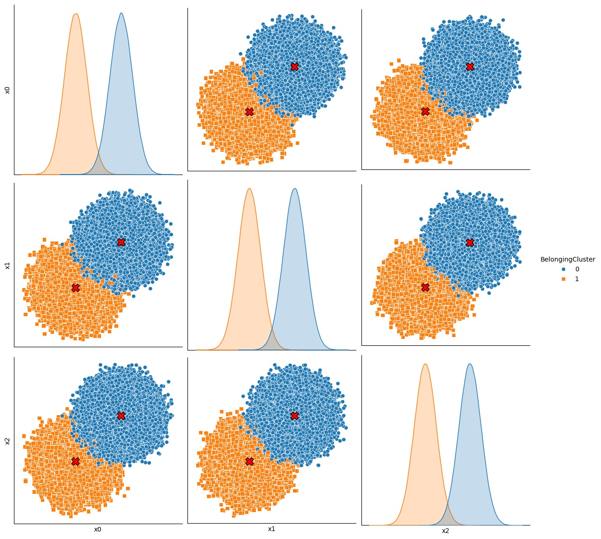
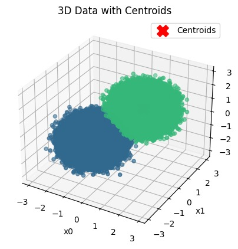
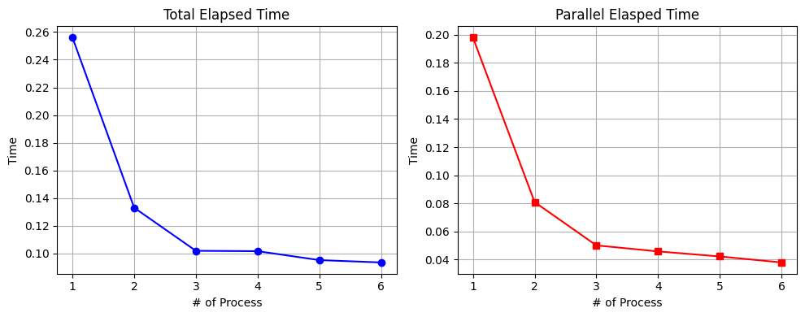
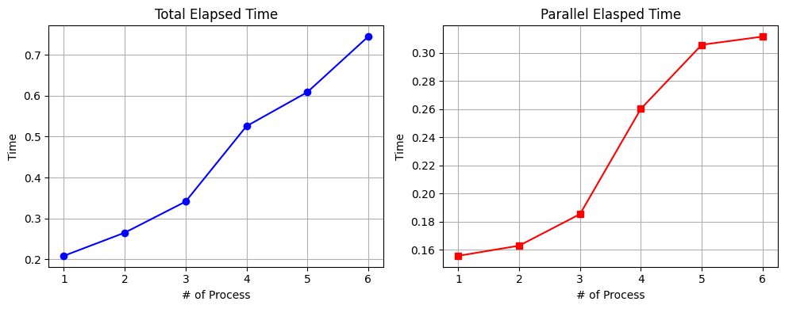

# K-means clustering: the filtering algorithm
_Authors: Ruben Beria, Federica Censabella, Camilo Martínez, Alessandro Neri, Giovanni Ornaghi_

## Table of content
- [Introduction](#introduction)
- [The filtering algorithm](#filtering_alg)
- [Implementation](#implementation)
- [Conclusions](#conclusions)
- [References](#references)

## Introduction  

K-means is a clustering algorithm, so it aims to partition n points in a d-dimensional space into k clusters (where k is an integer) in which each observation belongs to the cluster with the nearest mean.

In this project we implemented the k-means clustering method (also called Lloyd's algorithm), in particular we implemented the filtering algorithm described in [[1]](#ref_1) along with MPI-based parallelism.

## The filtering algorithm  

The filtering algorithm is based on storing data in a kd-tree (which is a multidimensional binary search tree often used for associative searching [[2]](#ref_2))

Such structure is built by setting the whole dataset as the root, then if a node contains at most one element (or in general fewer than a small constant) it is declared to be a leaf; otherwise the cell is split into two hyper-rectangles resulting in two sub-nodes which will be analyzed in the same way. In the end, we will obtain a tree that has O(n) nodes and O(log n) layers.
For each internal node of the tree, we keep track of the weighted centroid of the points contained in the corresponding cell .

Each node is also associated with a set of candidate centers, defined as a subset of centroids that might be the nearest neighbour for some point in the associated cell. The candidate set of the root initially contains all centroids, then at each subsequent splitting of the dataset, unsuitable elements are removed from the set.

A centroid z is removed from the candidate set for a given cell if, considering z* to be the closest candidate to the midpoint of the cell, there is not even one point for which z is closer than z*.

If the candidate set for a cell has cardinality 1, there is no need to split it further: all the points in the cell are assigned to the centroid in the set. 

On termination, each centroid is moved to the centroid of its associated points.

The convergence of the algorithm strongly depends on the choice of the initial centroids; however, there is no universally accepted criterion for selecting them optimally, nor does the main reference [[1]](#ref_1) suggest a specific one. In our case, the initial centroids are chosen as k random points in the data space, generated within the range defined by the minimum and maximum values of the dataset.

## Implementation  
In our implementation, the kd-tree is represented as a class `KDTree` containing a `Node` struct which stores all information related to one node (including pointers to its children in order to preserve the tree structure) and provides some useful methods to manage the data structure.

The functions that are needed to exploit the actual clustering algorithm are contained in the `kmeans.hpp` header file; they use the tree-management methods to explore each node as described in the filtering algorithm explained above.

For the sake of making the algorithm converge faster, we used MPI parallelism. After reading the dataset and generating the initial centroids, the process with rank 0 (referred to as the "master process") broadcasts them to all processes. The dataset is then evenly scattered among MPI processes (meaning that each process gets the same number of points, regardless of their spatial position [*](#not-exact-division) ), allowing each of them to construct their local kd-tree and analyze it using the filtering algorithm while keeping track of the weighted sums and counts of points assigned to each centroid. The partial results are then sent back to the master process which aggregates them to retrieve the new centroids and broadcast them to all processes.This procedure is repeated until convergence is reached.

In order to parallelize the given algorithm, we decided to apply a domain data decomposition and let each process build its own local tree based on a subset of the dataset instead of building one unique tree for the whole dataset as suggested in the paper [[1]](#ref_1). This approach allows us to share solely the centroids, thus minimizing the amount of data transfer, which is main overhead for MPI.

Finally, each process calculates the clustering for its subset of data and sends the results back to the master process, which assembles the complete clustering and writes the output file.

For testing and visualization purposes, we also provide two Python scripts to generate and plot the data. Also, in order to ensure that the most complex features woek, we wrote some tests available in the `/test` directory. 

## Conclusions  
At first we considered two possible approaches: the one described above and an algorithm that has the same structure as the one described in the paper [[1]](#ref_1). We ended up not choosing the second option because the code would have been less readable and less maitenable. That is due to the fact that the fork-join flow would have had to adapt to the tree structure and the communication of subtrees would have needed proper flattening and unflattening functions.

<table>
  <tr>
    <td align="center">
      
       
      <em>Pairwise projections (3D)</em>
    </td>
    <td align="center">
      
       
      <em>3D cluster scatter</em>
    </td>
  </tr>
</table>

The provided visualizations illustrate the output of our clustering algorithm applied to a multidimensional dataset. The 3D scatter plot demonstrates the spatial distribution of the data points, which are organized into two distinct, well-defined globular cluster. Complementing this, the pairwise projection matrix offers a comprehensive view of the feature space by plotting every dimension against the others. This matrix confirms that the clusters maintain high separability across all planes, as evidenced by the clear gaps between point clouds and the distinct, non-overlapping peaks in the marginal density plots. Such clear separation indicates that the underlying features provide strong discriminative power for the classification task.

### Strong scaling and weak scaling
Strong scaling is defined as the variation in execution time for a fixed total problem size as the number of processors increases. This scaling is governed by Amdahl’s Law, which posits that the maximum speedup is strictly limited by the serial, non-parallelizable fraction of the code.In a plot of Execution Time vs. Processes we expect a hyperbolic decay because ideally, doubling the processors should halve the execution time. However, in real-world scenarios, the curve will eventually deviate from this ideal path and reach a plateau because, as the number of processes increases, the computational work per processor decreases while the relative overhead of communication and the constant serial execution time are constant so they eventually dominating the total runtime.
Weak scaling describes how the execution time varies when the problem size per processor is kept constant, so as the number of processes increases, the total problem size grows proportionally. The objective is to determine the system's ability to handle larger, more complex simulations within a constant timeframe. This model is associated with Gustafson’s Law, which suggests that if the problem size is allowed to grow, the parallel efficiency can remain high.In a plot of Execution Time vs. Processes, the ideal trend is a constant horizontal line because theoretically, if the workload per processor is identical, the completion time should not change regardless of the number of nodes. In practice, we will likely observe a slight linear increase in execution time caused by the increased complexity of the communication network and the overhead required to synchronize a larger number of parallel tasks.

<table>
  <tr>
    <td align="center">
      
       
      <em>100000 3D points</em>
    </td>
    <td align="center">
      
       
      <em>100000 3D points per processor</em>
    </td>
  </tr>
</table>

The results demonstrate a performance profile consistent with standard parallel computing laws: the strong scaling graph exhibits a hyperbolic decay, where execution time drops sharply as the first few processors are added before reaching a plateau caused by the non-parallelizable serial fraction of the code. In contrast, the weak scaling graph maintains a slight positive slope, indicating that the system successfully handles an increasing workload proportional to the number of processors while incurring only minimal overhead from inter-process communication and synchronization.

## References  
1. Kanungo, T., Mount, D. M., Netanyahu, N. S., Piatko, C. D., Silverman, R., & Wu, A. Y. (2002). An efficient k-means clustering algorithm: Analysis and implementation. IEEE transactions on pattern analysis and machine intelligence, 24(7), 881-892.

2. J.L. Bentley, "Multidimensional Binary Search Trees Used for Associative Searching," Comm. ACM, vol. 18, pp. 509-517, 1975.

---

\* Actually the first process gets more points for an optimization.
